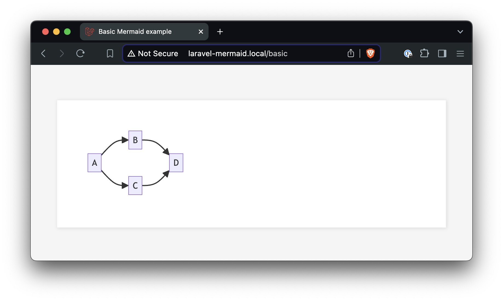
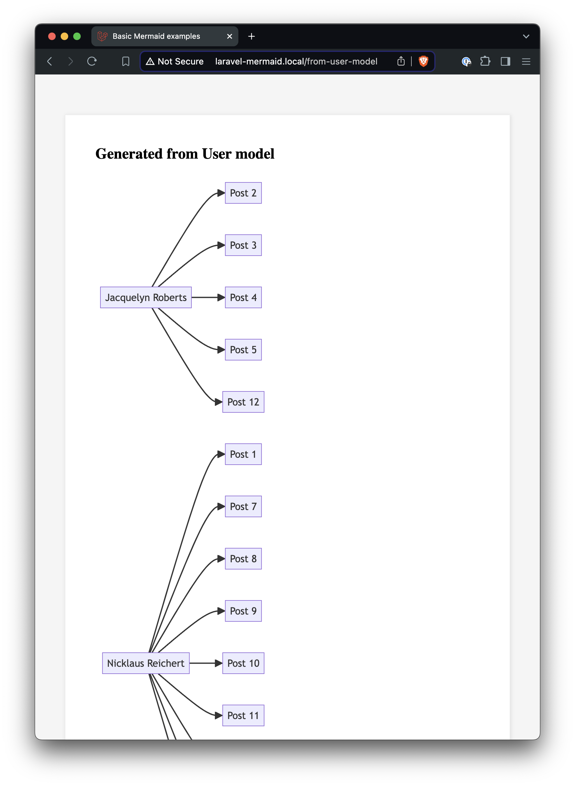
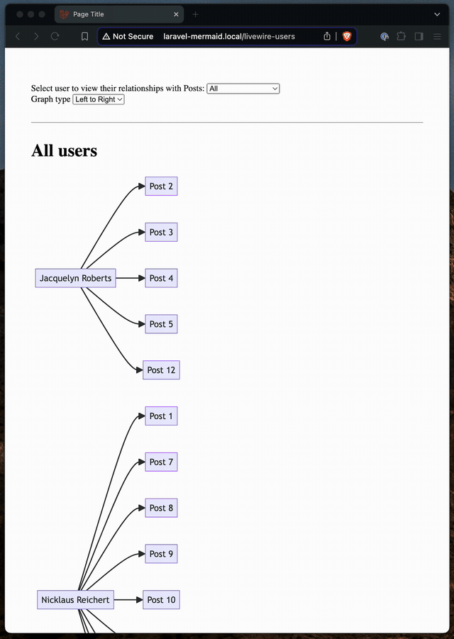
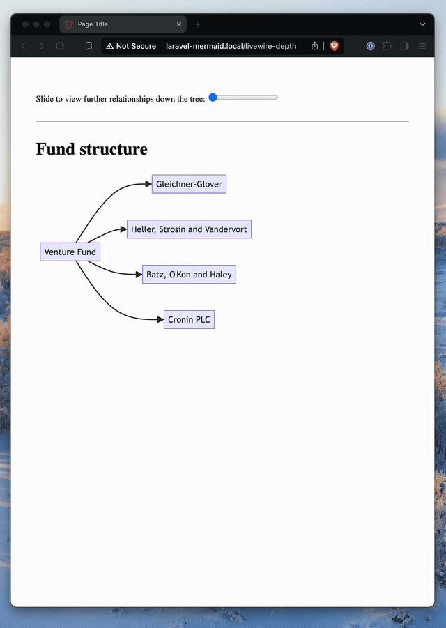
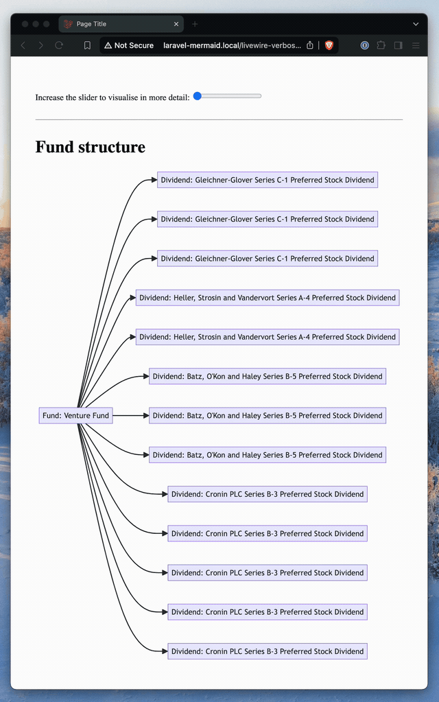

# laravel-mermaid-demo
 
## About the Laravel Mermaid package demo

This repository is dedicated to demonstrating the capabilities of the [Laravel Mermaid package](https://github.com/icehouse-ventures/laravel-mermaid), a package that allows you to easily generate Mermaid diagrams in your Laravel applications. Diagram types include flowcharts, user journeys, entity relationship diagrams and mind maps.

## Examples

Once running, you'll find the following examples.

#### Basic Mermaid rendering

A basic example rendering your own Mermaid diagram.



#### Automatic generation from your Eloquent models



#### Livewire example + changing chart types



#### Livewire example visualising depth 



#### Livewire example increasing verbosity



## Quick start with Docker

To run the examples locally via Docker, first build the services:

```
docker-compose build
```

Copy the `.env.example` file:

```
cp .env.example .env
```

Then start the services:

```
./bin/up
```

Run the init command to install dependencies etc:

```
./bin/init
```

When you're done, shut down the services with:

```
./bin/down
```

## Contributions

Contributions are welcome! If you have any improvements or additional examples, please feel free to submit a pull request.

## License

This demo is open-sourced software licensed under the [MIT license](https://opensource.org/licenses/MIT).